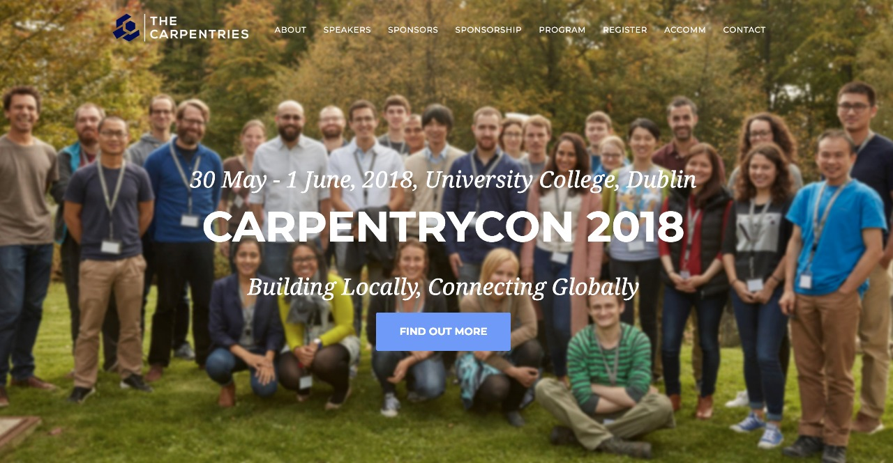
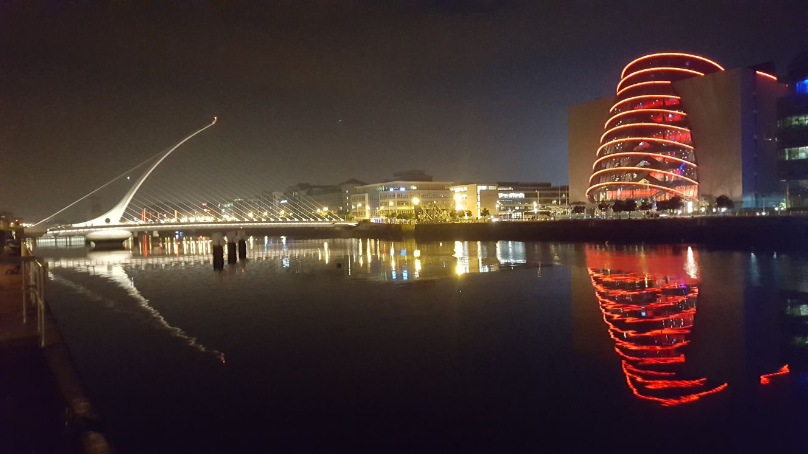
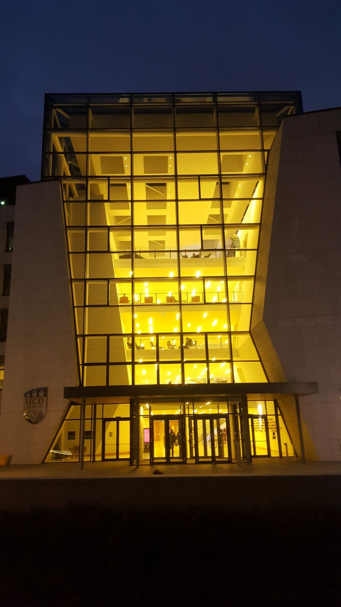
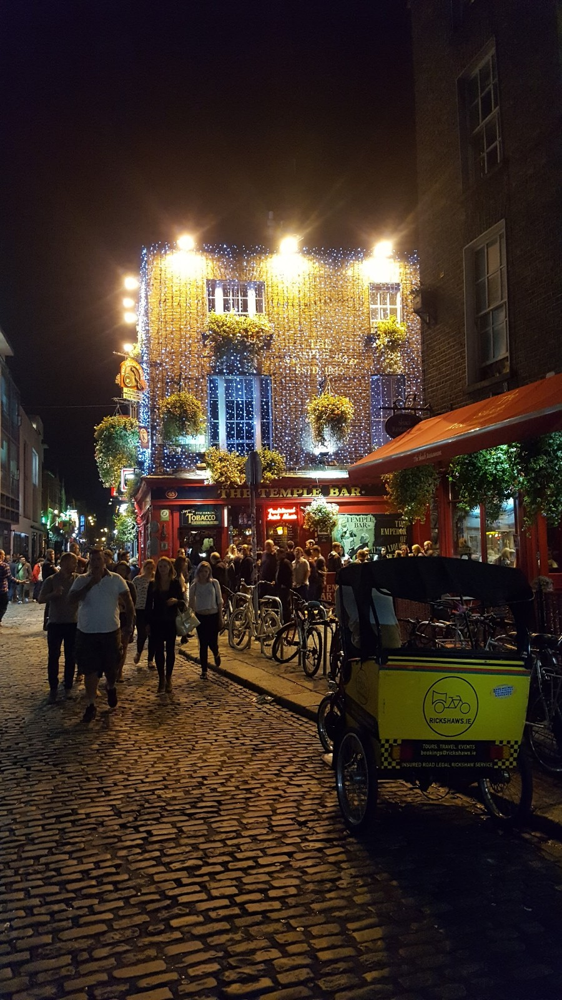
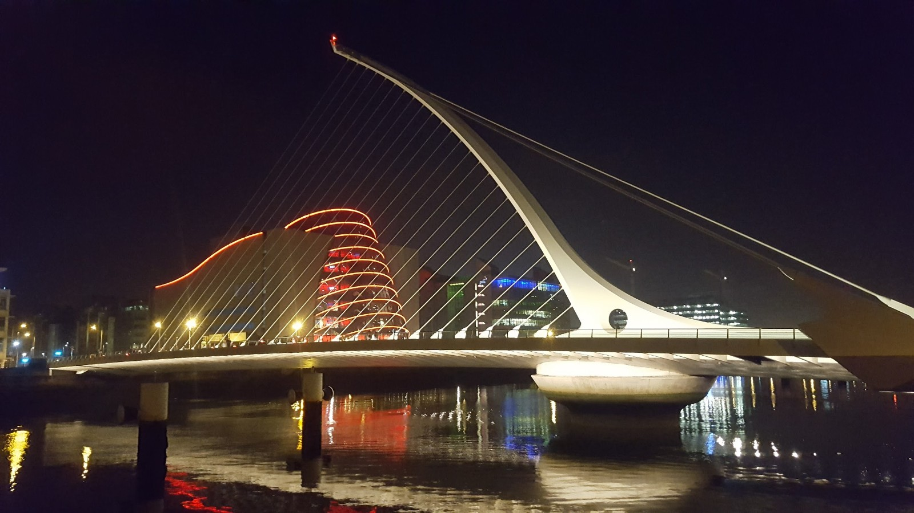
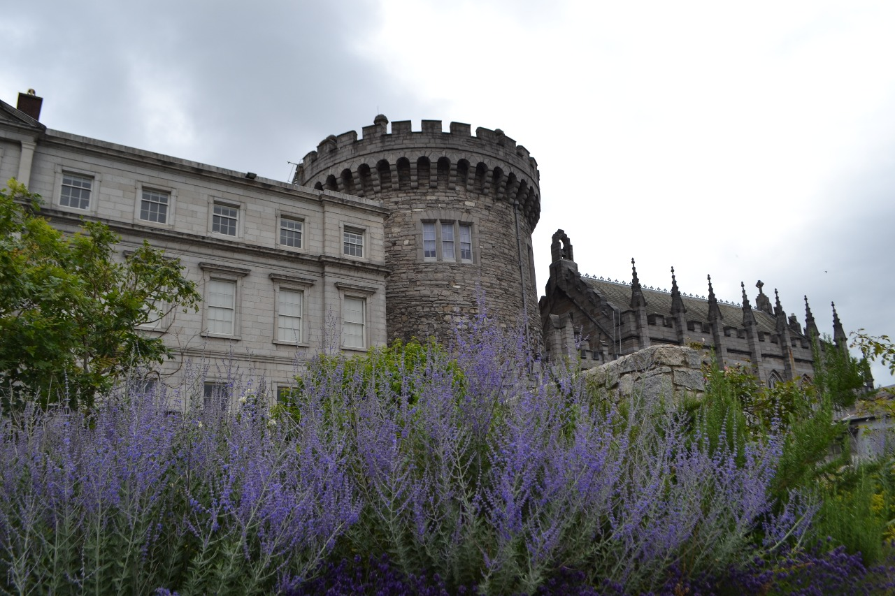
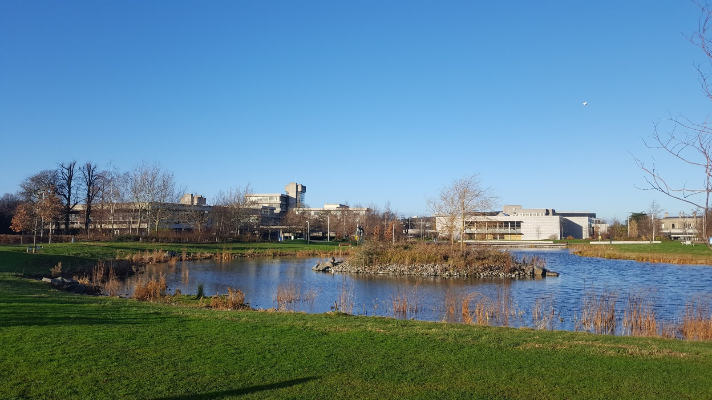

## A to Z of CarpentryCon

#### Compiled by: Malvika Sharan with the CarpentryCon 2018 Volunteers
***Your pull-requests are welcome.***

Below you will find all the information that we thought might help you plan your trip to Dublin for CarpentryCon 2018. We took this challenge at one of our several meetings to find all the keywords starting A-Z to address any queries you might have about the conference. We are pretty confident that the following list covers everything, but please reach out to us and let us know if something is missing. Please take a look at this so that you can plan your stay in Dublin ahead of time and have the best time during the conference. We are very excited to meet you at CarpentryCon 2018!



##### *Screenshot of the official website: carpentrycon.org. Original background picture by Hugo Neves at EMBL Annual Software Carpentry Course 2017*

### A: Arrival, Access, Accommodation, Allies

#### Arrival and Access

The conference is being held at the [O'Brien Centre for Science](http://www.ucd.ie/conferences/venues/classroom-and-theatres/)
at [University College Dublin](http://www.ucd.ie/).

```
  UCD O'Brien Centre for Science
  UCD Science Centre (East)
  University College Dublin
  Belfield, Dublin 4
  Roebuck, Dublin
  Ireland
  (01) 716 2120
 ```

Link to [Google Map](https://goo.gl/maps/xpnddSdsZ8n) and [campus map](http://mdd.ucd.ie/wp-content/uploads/2015/05/UCD-Map-October-2014-Custom.pdf). There is also a useful [commuters' guide](http://ucdestates.ie/commuting/) that can be [downloaded as a PDF](http://ucdestates.ie/commuting/wp-content/uploads/sites/3/2016/08/Campus-Commuting-Guide-2016.pdf). 

When you first arrive, you can exchange your registration ticket for a name tag, badges and lunch tickets. The registration desk will be located at the conference site from May 30 - June. We will have a designated Welcome Team of organizers and volunteers who you can recognize by their T-shirts and name tag. You will have access to the lecture hall and breakout rooms, look out for the signs at the venue. Do not hesitate to reach out to the Welcome Team during the conference for any query or concern. The venue is wheelchair accessible. The Welcome Team will be happy to provide you any additional support.

#### Accommodation

We have listed all the [accommodation options](http://www.carpentrycon.org/#accom) on the CarpentryCon website. The UCD on-site accommodation ([Summer at UCD](http://www.ucd.ie/summeratucd/accommodation/)) is located within walking distance to the conference venue and their reception Office is open 24/7 from the 28th May onwards. The corresponding accommodation provider will provide you with all the required information. Several of these sites are wheelchair accessible. You must make sure that you have made arrangements for your accommodation in one of these (or other) hotels.

#### Allies

An ally is someone who uses her/his/their societal privileges for supporting members of other identity groups. We would like to create an inclusive environment at CarpentryCon and invite you to extend your support to others at this conference and beyond. You can learn through [resources](https://frameshiftconsulting.com/ally-skills-workshop/#materials) made available by one of our Keynote speakers [Valerie Aurora](https://github.com/carpentries/carpentrycon/blob/master/ShortBio/Speakers/ValerieAurora-bio.md). Additionally, Valerie will offer the [Ally workshop](https://github.com/carpentries/carpentrycon/tree/master/Sessions/2018-06-01/03-Workshop-3-Ally-Workshop-With-Valerie-Aurora) on June 1 in parallel to other workshops.

### B: Badges, Break-out sessions, Bars

#### Badges

We will offer you a range of badges (speakers, course maintainers, job seeker, new members etc.) to indicate your roles and interests in CarpentryCon and The Carpentries. These badges could be worn with your name tag to help you make the best of the social interaction at the conferences.

#### Break-out sessions

There will be 12 breakout sessions during CarpentryCon (http://www.carpentrycon.org/#program) including the sessions on [Carpentry Methods in University Courses](https://github.com/carpentries/carpentrycon/blob/master/Sessions/2018-05-30/04-Breakout-1-Carpentry-Methods-In-University-Courses/Abstract.md), [Diversity and Inclusion](https://github.com/carpentries/carpentrycon/blob/master/Sessions/2018-05-30/12-Breakout-6-Diversity-And-Inclusion/Abstract.md), [HPC carpentry](https://github.com/carpentries/carpentrycon/blob/master/Sessions/2018-05-31/05-Breakout-8-HPC-Carpentry/Abstract.md), and [mentoring](https://github.com/carpentries/carpentrycon/blob/master/Sessions/2018-05-31/12-Breakout-12-Mentoring/Abstract.md). The abstracts of all these sessions can be found in the [CarpentryCon GitHub pages](https://github.com/carpentries/carpentrycon/tree/master/Sessions) (separated by dates). There will be a limited number of seats available for each of these. Closer to the conference we will send out more information on how to register for those (look out for that).

#### Bars

Dublin is a city of bars and pubs (but not only). We have a list of bar suggestions (by our UCD Volunteers Ben and Chiara) on the Etherpad dedicated to the discussion of [social activities at CarpentryCon](http://pad.software-carpentry.org/social_events). Please expand the list, if you have any additional recommendations.

### C: Carpentries, CarpentryCon and Cheatsheet, Code of Conduct, Child Care, Coffee, Catering, Currency

#### The Carpentries
<br><br>

<br><br>

##### *Official logo of The Carpentries*

The Carpentries (https://carpentries.org/), brings Software and Data Carpentry together under an umbrella to teach foundational computational, coding, and data science skills to researchers worldwide. We are a diverse, global community of volunteer Instructors, helpers, Trainers, Maintainers, champions, member organizations, supporters, and staffs.

#### CarpentryCon 2018 and Conference Cheatsheet

CarpentryCon 2018 (http://www.carpentrycon.org/) is the inaugural annual conference for all the members of the Carpentries. Under the theme “Building Locally, Connecting Globally”, we have planned a number of events and opportunities for you including keynote talks, skill-up sessions, breakout discussions, social events, lightning talks, and workshop. This will provide a diverse and inclusive environment for learning, skill-building, and networking event for the participants interested in computational techniques to enhance the quality and efficiency of their work, and have a great time at the conference.

See this [conference cheatsheet](https://github.com/carpentries/carpentrycon/blob/master/CarpentryCon_Cheatsheet.md) for all the relevant links to our resources and program.

##### Code of Conduct

As a member and conference participant, you are requested to familiarize yourself with The Carpentries' [Code of Conduct](https://docs.carpentries.org/topic_folders/policies/code-of-conduct.html).

*Code of Conduct in Short*: The Carpentries are dedicated to providing a welcoming and supportive environment for all people, regardless of background or identity. Enforcement of the Code of Conduct will be respectful and not include any harassing behaviors. Harassment in any form or behavior intended to exclude, intimidate, or cause discomfort is a violation of the Code of Conduct. If you believe someone is violating the Code of Conduct we ask that you report it to the CarpentryCon TaskForce members or the Code of Conduct committee members (Karin Lagesen, Kari Jordan and Malvika Sharan) at the conference in person, by email or on Slack, who will take the appropriate action to address the situation. You can also reach out to the Carpentries Policy Committee by emailing policy@carpentries.org.

##### Child Care

Parents/Families traveling with child/children must inform the organizers if they would be attending the conference with their child/children so that we can provide you with all the necessary information and support from our end. For mothers who need a designated space at the conference for nursing, please look for the nursing signs upon arrival of the conference.

##### Coffee and Catering

Of course! One of the most important conference supplies, coffee, will be offered at the conference during the breaks. Here is a list of all the [coffee/food places in UCD](http://www.ucd.ie/students/guide/food.html), if you want to take a walk during and after the conference and find other non-conference coffee. Lunch will be provided at the conference for the registered participants. We will use the catering services of the Pi Restaurant located in the same building as the venue. We will take care of the different dietary requirements if you have mentioned it in your registration. Please let the organizers know if you'd like to amend your specified dietary requirements. (See *Veg()an+ and Special Requirements*)

##### Currency

The currency used in the Republic of Ireland is Euros.
See this article for everything you need to know about currency exchange in Dublin: https://transferwise.com/us/blog/currency-exchange-dublin

TIP: if you are paying with a foreign bankcard/creditcard/debitcard and get asked whether you want to pay in Euro or your own currency, choose EURO - it will save you money in the end (see [this article]( https://www.forbes.com/sites/geoffreymorrison/2014/07/30/pay-in-local-or-home-currency/#5bb059723307)).

### D: Dublin, Diversity, Data Carpentry



##### *Samuel Beckett Bridge and the beer barrel shaped Convention Centre, image by Norman Davey*

#### Dublin

Our host city [Dublin](https://en.wikipedia.org/wiki/Dublin) is known for its rich history, culture, and Georgian architecture. Find all the information we collected about the city in the context of CarpentryCon on the [venue/accessibility page](https://github.com/carpentries/carpentrycon/blob/master/venue.md). Make sure that you go out in the evening with other participants to explore the city and its wonderful bustling restaurants and bars.

#### Diversity

The Carpentries is a community of volunteer instructors, helpers, Trainers, Maintainers, champions, member organisations, supporters, and staff, of diverse background, nationality, ethnicity, gender and various identity groups. We are working hard to ensure that everyone feels welcome at CarpentryCon. Feel free to reach out to the organizers and staff if they can improve your experience as a member at The Carpentries and CarpentryCon. Attendees must be prepared to abide by our Code of Conduct (see *Allies, Carpentries, Code of Conduct, Inclusion, Emergency*).

#### Data Carpentry

[Data Carpentry (DC)](http://www.datacarpentry.org/) provides researchers high-quality, domain-specific training covering the full lifecycle of data-driven research. There will be an information desk where you can collect information on DC team, their work, workshops and various ways to get involved with their activities. Additionally, several DC members will be attending CarpentryCon (you can identify them by their badge), giving participants an opportunity for face-to-face networking.

On May 28-29, right before the conference, we are offering a DC workshop (genomics module) at UCD, with a limited seat available for the external participants. You can find the course detail [here](https://malvikasharan.github.io/2018-05-28-Dublin/).

### E: Executives, Emergency, Etherpads, Entertainment, Events, Exhibition

#### Executives

The Carpentries is governed by the newly formed Executive Council, to whom the Executive Director reports. The Council comprises nine members, four elected by the community, and five appointed from the former Steering Committees of Software and Data Carpentry. [Find out more about the council and their work](http://static.carpentries.org/governance/).

#### Emergency

In case of emergency, please contact the Welcome Team/organizers via phone **+353 (0) 8339 01891** (will be active only during the conference), email (carpentrycon@carpentries.org) or [slack](https://tinyurl.com/carpentrycon-slack).


##### *Image source: http://img.pagecloud.com*

Here is a list of few other emergency contacts:
- Campus Services (for on-campus emergencies): 01 716 7999
- Ambulance/ Gardaí and Emergency Services: 999 or 112
- Nearest pharmacy: [Procare Pharmacy UCD](https://goo.gl/maps/hoxNWogRPWE2), Phone: 017163840
- Check the list of all other important contacts on [this page](https://github.com/carpentries/carpentrycon/blob/master/venue.md).

#### Etherpads

We like to work collaboratively and use [Etherpad](http://pad.software-carpentry.org/pad-of-pads) for organizing our communication in different Carpentries channels. Here is a list of etherpads that are relevant for CarpentryCon.

- *Main CarpentryCon*: http://pad.software-carpentry.org/carpentrycon
- *Social Activities*: http://pad.software-carpentry.org/social_events
- *CarpentryCon Community Call*: http://pad.software-carpentry.org/carpconcall
- *CarpentryCon Volunteers*: http://pad.software-carpentry.org/carpentrycon_volunteers
- *CarpentryCon TaskForce Meetings*: http://pad.software-carpentry.org/2018carpentrycontaskforce
- *Pad-of-Pads for all other Carpentries etherpads*: http://pad.software-carpentry.org/pad-of-pads

#### Entertainment and Events

The evening before the conference, we will book a small pub so that you get a head start on the social part of the conference. Please [fill this doodle](https://doodle.com/poll/37i357fyd8ard9d6) with your name and email to be notified. The poster reception on the 1st day and conference dinner on the 2nd day will allow you to get to know other attendees in informal settings and spend quality time with them at the conference. During the conference we have planned several opportunities for you (break-out, open-mic, coffee breaks) and platforms ([etherpad](http://pad.software-carpentry.org/social_events), [slack](https://tinyurl.com/carpentrycon-slack), [twitter](twitter.com/CarpentryCon)) to socialize with each other and make spontaneous plans to explore the city and surroundings during the evening. Take a lead and organize sessions and social activities with others.

#### Exhibition

We will offer an opportunity to the exhibitors (commercial and non-commercial) to acquire a booth at CarpentryCon. We can place max 25 exhibitors at the conference site, therefore contact the organizers for a possibility for you to have a booth there.

### F: Fitness, Friends, and Family

#### Fitness

If you are in the city, you can check the [running trails](http://trailrunningireland.com/irish-trails-list/) to get your daily dose of fitness activity. You can also take a [sightseeing by jogging tour](http://www.sightjoggingdublin.com) or follow different [UCD Woodland Trails](https://www.ucd.ie/t4cms/UCD%20Woodland%20Walk%20Map%20and%20Guide.pdf) depending on where in the city you are. Here is a [list of swimming pools](https://www.yelp.ie/search?cflt=swimmingpools&find_near=ucd-sport-and-fitness-dublin) near UCD.

#### Friends and Family

Your partner, family members or guests are invited to attend the keynote lectures and poster session if they are on campus during the conference. However, the break-out, skill-up, and workshops will be limited to the conference attendees for their participation. Here is a list of [on-campus cafe and restaurants](http://www.ucd.ie/students/guide/food.html) which will be accessible to them while they are in the UCD area. You can purchase a conference dinner ticket for partner/family member/friends through our [registration page](https://www.eventbrite.com/e/carpentrycon-2018-tickets-42447719271). Contact the organizers if we can help you in any way. See the related sections for *Childcare, Nursing, Medical, Events, Fitness* etc. for related information.

### G: Guinness


##### *Image source: thetaste.ie*

The Guinness Storehouse, located at St. James’s Gate Brewery in Dublin is the number one tourist attraction in Dublin. This seven-story building is a museum featuring 250 years of history of Guinness advertising and interactive exhibit on responsible drinking. The top floor offers a beautiful view of the city over drinks (both alcoholic and non-alcoholic) and food from its Gravity Bar. It is open every day from 09:30 to 19:00 and is wheelchair accessible. See [here](https://www.guinness-storehouse.com/) for information about visiting the Guinness Storehouse.

### H: Helpers and Helpdesk

We will have a helpdesk at the venue where you can get all the information that you may need during the conference. We will also have a designated Welcome Team, who will help you during the day to get orientated at the conference venue. For any request for special needs and help, get in touch with the organizers.

### I: Icebreaker, Inclusion

#### Icebreaker

Many people coming to CarpentryCon 2018 will be new to our community. We know that coming into any big event for the first time can be a little intimidating. You may not know anyone but it seems like everyone else knows lots of people. We want to make sure that everyone who comes to CarpentryCon 2018 feels a sense of belonging right from the start. As the first activity at CarpentryCon, Belinda Weaver have planned an icebreaker event for everyone to connect with a small group of people to swap stories about why they are here. See [here](https://github.com/carpentries/carpentrycon/blob/master/Sessions/2018-05-30/00-Icebreaker-Story-Circles.md) for detail.

#### Inclusion

We want to create an inclusive and welcoming environment at the conference. We are providing travel assistance to facilitate attendance from as wide a group as possible. We are collecting full details to identify needs for childcare and mobility, accessibility and dietary preferences during registration. Feel free to reach out to the organizers and staff if they can improve your participation at CarpentryCon. (see *Allies, Carpentries, Code of Conduct, Diversity, Emergency*)

### J: Job Board, Join the Carpentries

#### Job Board (Job Seekers & Job Providers)

We will have a job board at the conference where you can post/advertise both interest in jobs and relevant job offers.

#### Join the Carpentries

There are several ways to become a member of [The Carpentries community](https://carpentries.org/community/) and support its work. At CarpentryCon, there will be different booths for The Carpentries and opportunities to meet the volunteer members to learn more about it. See [here](https://carpentries.org/join/) for more detail.

### K: Keynote Speakers, Knowledge sharing


##### *Official poster created by Malvika Sharan - Slack voting/suggestions by Greg, Mark, Erin and Maneesha* :)

#### Keynote Speakers

We have fantastic keynote speakers lined up for you at CarpentryCon. Our 4 speakers are: **Valerie Aurora** (founder of FrameShift consulting for diversity & inclusion in tech), **Desmond Higgins** (professor of bioinformatics in UCD, and recipient of 2018 Benjamin Franklin Award for Open Access in the life sciences), **Anelda van der Walt** (founder of Talarify, and recipient of 2017 Carpentries Community Service Award for her work in South Africa), **Greg Wilson** (co-founder Software Carpentry. Head of Instructor Training for DataCamp). We are very excited to have these leaders from their field at CarpentryCon and are looking forward to their talks. See the [official website](http://www.carpentrycon.org/#comp) for more detail.

#### Knowledge sharing

We, as organizers, have put a lot of efforts into making sure that you get several opportunities to learn new skills and ideas while expanding your network. In this 3-day high-intensity conference you will learn from: (1) the experts, through keynote talks, skill-up session, and workshops, (2) share your ideas with each other, in discussion/breakout sessions and get tips from the session leads and other attendees, (3) suggest, vote for and lead a session on the spot and share your own best practices and challenges. At the conference, you will be surrounded by the community leaders and trainers, and everyone is seeking to learn. We can assure you that you will get much more than 'just another conference experience', if you reach out to your neighbor during coffee breaks, at the watercoolers, while sharing charging stations, at lunches, in the breakout rooms, and at conference receptions.

### L: Lightning talks, Library Carpentry

#### Lightning talks

We have lightening talk sessions (divided by topics) on the first and second day of the conference, please see the [conference program](http://www.carpentrycon.org/#prog). You are welcome to submit abstracts, see [here](https://carpentries.typeform.com/to/AImKAG) for more detail.

#### Library Carpentry

Library Carpentry, is made by librarians, for librarians to help you automate repetitive, boring, error-prone tasks, create, maintain and analyse sustainable and reusable data, work effectively with IT and systems colleagues, better understand the use of software in research and much more. Library Carpentry introduces you to the fundamentals of computing and provides you with a platform for further self-directed learning. See [here](http://librarycarpentry.github.io/our-sponsors/) for more detail. Shortly before CarpentryCon, Library Carpentry and The Carpentries mutually decided to enter into a conversation with each other about incorporating Library Carpentry as a Carpentries lesson program.

### M: Medical, Mentoring, Meet-ups

#### Medical

We will have basic medication and first aid support at the venue. The closest pharmacy is within 5 minutes walking distance, on the UCD campus ([Procare Pharmacy UCD](https://goo.gl/maps/hoxNWogRPWE2), Phone: 017163840). If you have any specific medical needs, let the organizers know in advance so that they make the necessary arrangements for you. See *Emergency* for other relevant contact lists.

#### Mentoring

Mentorship is an important part of the Carpentry experience. As Instructors, we both teach and mentor our Learners. We also mentor each other as Instructors, learning something new from each other every time we teach and interact with one another. The Mentoring Subcommittee offers guidance to new and continuing Instructors through weekly discussion sessions, where Instructors from the global Carpentry community gather to share their experiences and learn from each other. This is a fantastic opportunity to interact with other Carpentry Instructors from around the world. (Read more on the The Carpentries [Blog1](https://software-carpentry.org/blog/2017/10/mentoring-wrap-up.html) and [Blog2](https://software-carpentry.org/blog/2018/03/next-round-mentoring.html)).

There are several things planned for you at the conference, which include break-out sessions, social activities, badges to show your involvement and a desk where you can learn more about the existing mentoring program and its activities.

#### Meet-ups

We will organize a pre-conference meet-up (more information will be added) and an official conference dinner. We will offer you opportunities to organize your own small meet-ups and invite the participants (see *Social Activities and Friends and Family*). If you have some ideas or suggestions, please let the organizers know so that they can help you in setting it up. Check out [this etherpad](http://pad.software-carpentry.org/social_events) for existing ideas, and add your name under the relevant sections.

### N: New Members, Name Tags, Nursing

#### New Members

Are you new to The Carpentries? Do you want to learn more about the organization and how you can support it? CarpentryCon is the place for you. Actually a **_better_** start for you than the rest of us had, as you will have an opportunity for face-to-face networking and interaction. We understand that it could be frightening if you don't know anyone, but the community has a history of being very friendly and inclusive, so don't be afraid to say 'Hi' and introduce yourself. You will be surprised how many lasting collaborations you will make at the conference. Join the ice-breaking session to get a head start to networking, and when in doubt, contact the Welcome Team.

#### Name Tags


##### *[Image source: mynamebadges.com](https://images.mynamebadges.com/img/lg/L/my-name-preferred-pronouns-label-lb-2525.pn)*

Name tags are a great way for participants to strike up conversations with other participants or volunteers. You can collect your name tag at the registration desk (don't forget to bring your registration ticket). We will be offering you a list of badges (e.g. speaker, trainer, task-force, volunteers, new members etc.) to add to you name tag to let others know your interests, roles and expertise, which will help you network more efficiently. Our name tags will have a section to add your pronoun preference. As a participant, be respectful to each other by using the correct name and pronoun. Ask! if you don't know how to pronounce someone's name, maybe they will share a nice story about what their name means.

#### Nursing

For mothers who need a designated space for nursing, please look for the nursing signs upon arrival of the conference. Please let the organisers know if you will be traveling with an infant and would like to place any special requests. Please see *Childcare, Special Requirements, Friends and Family* for related information

### O: O'Brien Centre, Open mic

#### O'Brien Centre

The conference is being held at the [O'Brien Centre for Science](http://www.ucd.ie/conferences/venues/classroom-and-theatres/)
at [University College Dublin](http://www.ucd.ie/).

 

##### *O'Brien Centre, images by Norman Davey*

The UCD O'Brien Centre for Science is located on UCD's Belfield campus, 4 km south of Dublin
city centre. Link to [Google Map](https://goo.gl/maps/xpnddSdsZ8n) and [campus map](http://mdd.ucd.ie/wp-content/uploads/2015/05/UCD-Map-October-2014-Custom.pdf).

The keynote lectures will take place in the George Moore Auditorium, which can be found on the ground floor of the O'Brien Centre's East wing (#67 on the campus map, above) on the left hand side of the main foyer. Specific workshop, skill-up, and breakout rooms will be anounced as information becomes available.

#### Open mic

The majority of The Carpentries community is constituted by its volunteer trainers (who also go on to take up more roles in The Carpentries). If you are a new trainer, our 'Open Mic' sessions will be very useful for you. If you are a more experienced trainer, it's an opportunity for you to pass your knowledge to the session attendees. Please see our [program](http://www.carpentrycon.org/#program) and prepare yourself up to come up on the podium in one of these sessions.

### P: Pronouns, Photography, Posters, Pre-conference, Post-conference

#### Pronouns

It has become a general practice to share pronouns (He/She/They/Ze etc.) on conference name tags. For those unfamiliar with the practice of sharing pronouns at the conference, it goes something like this: “Name: Malvika Sharan. Pronouns: she/her”. This practice is important for making sure that we use correct pronouns, specifically for our trans, queer, and gender non-conforming community members you will meet at CarpentryCon.

#### Photography

You are allowed to take photographs at the conference. Make sure that you do not disturb any session or others in the process. We will offer a differently colored lanyard to those who **don't want to be photographed**. Be respectful of their decision and don't take/post their pictures on social media. A few volunteers will be taking pictures to be included to the official collection, you are welcome to join them. If you want to post pictures on social media, use the hastag #carpentrycon2018 to tag the conference, so that other attendees and those who couldn't join the conference can find your posts.

#### Posters

We will have a poster session and a designated area for the display of posters. You should use the A0 poster size (vertical). Any other specifications will be added if required. The deadline for the abstract submission is May 4th.

#### Pre-conference

We will send out an email to all the registered participants with all the information we think you must have before arriving to the conference including the [CarpentryCon cheatcheet](https://github.com/carpentries/carpentrycon/blob/master/CarpentryCon_Cheatsheet.md). The email will have link to the pre-conference survey to allow you choose your sessions of preference and add any special need that you may have. It's crucial that you respond to the survey to secure a place in the sessions of your choice. We invite you to our optional Social Event at the **Clubhouse** on May 29, 18:00 onward.

##### Pre-conference Checklist

My personal checklist will have very basic reminders like: check your flight_schedule-alarm-passport-visa-keys-wallet-cash-hotel_address-charger-headphones-book-clothes-phone-laptop, take out the garbage, water your plant, lock your door, panic (*did I close the windows!*) - you get it. I didn't want to assume that everyone needs an exhaustive list of reminders like I do, so like any other sensible adult, I asked twitter for advice. [Here is what I got](https://twitter.com/MalvikaSharan/status/990973533823078400):

<blockquote class="twitter-tweet" data-lang="en"><p lang="en" dir="ltr">What do you have in your pre-conference list? Help me fill this list for the <a href="https://twitter.com/CarpentryCon?ref_src=twsrc%5Etfw">@CarpentryCon</a> participants who are coming to <a href="https://twitter.com/ucddublin?ref_src=twsrc%5Etfw">@ucddublin</a> <a href="https://twitter.com/hashtag/Dublin?src=hash&amp;ref_src=twsrc%5Etfw">#Dublin</a> to attend the <a href="https://twitter.com/hashtag/carpentrycon2018?src=hash&amp;ref_src=twsrc%5Etfw">#carpentrycon2018</a>. Pull requests are welcome on this <a href="https://twitter.com/github?ref_src=twsrc%5Etfw">@github</a> link: <a href="https://t.co/fL1uVvxwT1">https://t.co/fL1uVvxwT1</a></p>&mdash; Malvika Sharan (@MalvikaSharan) <a href="https://twitter.com/MalvikaSharan/status/989883041035276288?ref_src=twsrc%5Etfw">April 27, 2018</a></blockquote>

<blockquote class="twitter-tweet" data-lang="en"><p lang="en" dir="ltr">Do you mean these kinds of things? Business cards. Stuff to read while traveling. Power adaptors (many non-UK will need one). Some local currency. A4/US letter printouts of your poster to hand out.</p>&mdash; Lex Nederbragt (@lexnederbragt) <a href="https://twitter.com/lexnederbragt/status/991010647025618944?ref_src=twsrc%5Etfw">April 30, 2018</a></blockquote>

<blockquote class="twitter-tweet" data-lang="en"><p lang="en" dir="ltr">Ok, some more then. If you are going to present from your own laptop, video adapter(s) (most places do HDMI now, but VGA is still around). Ear plugs for when the accommodation is noisy. Some nuts or other healthy snacks for when you’re hungry and far away from food.</p>&mdash; Lex Nederbragt (@lexnederbragt) <a href="https://twitter.com/lexnederbragt/status/991231811622719488?ref_src=twsrc%5Etfw">May 1, 2018</a></blockquote>

Also, someone has already written a blog on [What to Pack & Prepare Before Any Big Conference](https://blog.hubspot.com/marketing/pre-conference-packing-checklist).

#### Post-conference

The post-conference period will be equally crucial to evaluate the success of the conference. Please fill the [post-conference survey](https://www.surveycrest.com/s/2018carpentryconfeedback) after the conference to learn about your experiences from this conference and suggestions for the next one. We will also organize a community call to discuss the survey results and the plans for the next conference: carpentryCon 2019.

### Q: Questions, Quiet Rooms

#### Questions

Get in touch with the organisers (carpentrycon@carpentries.org) if you have any specific questions about the conference. Join the community call (May 3) to discuss with them in person ([see the notes](http://pad.software-carpentry.org/carpconcall)). At the conference, you can approach the Welcome Team for any specific queries. Join our [Slack channel](https://tinyurl.com/carpentrycon-slack1) for any recent discussion and updates.

#### Quiet Rooms

If you need a quiet place while attending CarpentryCon, there will be space available. Please see the program or ask a volunteer where the room will be located. We ask that while you are in the room that you are mindful of others who may be sharing the space as well.

The following prayer rooms are available on campus:
- UCD Muslim/Islamic Prayer Room
- UCD Chaplaincy prayer room - St Stephens

### R: Registration, Ramadan Period, Restaurant suggestions

#### Registration

The [online registration](https://www.eventbrite.com/e/carpentrycon-2018-tickets-42447719271) is open. We will have an opportunity for on-site registration but please let the organisers know in advance. More information about the workshop registration will be added here.

The registration desk will be available on site from May 30 to June 1. Please bring your registration confirmation, which can be swapped for your name tag and badges.

#### Ramadan Period During CarpentryCon

Ramadan is regarded as the holiest period of the year in the Muslim communities and takes place on the ninth month of the Muslim year. People with Islamic faith observe Ramadan by fasting from sunrise to sunset. Since CarpentryCon is taking place in Ramadan period, we would like to offer support to our attendees in way we can.

Here is a few information we collected for you:

- [Ramadan prayer time in Dublin](https://hamariweb.com/islam/dublin_ramadan-timing168578.aspx)
- Dedicated prayer rooms for Muslim students are located in [Woodview House on the Belfield campus](https://goo.gl/maps/b7M1Uj5jQXA2), which is 5 minutes by foot from the conference venue
- [Dublin mosque](https://en.wikipedia.org/wiki/Dublin_Mosque) and [Islamic Cultural Centre of Ireland](https://islamireland.ie/), [google maps](https://tinyurl.com/y7bvzt9q)
- [Ramadan in Dublin](https://colettecolfer.wordpress.com/tag/ramadan-in-dublin/)

Please help us support you by supporting your peers at the CarpentryCon. Here is how you can do it:

- Our Muslim participants can share relevant information with each other and organize their 'Iftar'. Feel free to use Slack and/or [etherpad for social activities](http://pad.software-carpentry.org/social_events).
- Our non-muslim participants can extend their support by learning about Ramadan through these articles:
  - [What is Ramadan?](https://www.livescience.com/61815-what-is-ramadan.html )
  - [Ramadan 2018: All you need to know.](https://gulfnews.com/guides/life/ramadan/features/ramadan-2018-all-you-need-to-know-1.1528649)
  - [Every awkward question you have about Ramadan answered.](https://www.joe.ie/life-style/a-beginners-guide-to-ramadan-548073)

#### Restaurant suggestions

We will be using the catering service from Pi Restaurant, which is located in the same builiding as the conference venue. More restaurant suggestions including [restaurants for Iftar](https://colettecolfer.wordpress.com/2013/07/24/iftar-in-a-pakistani-restaurant-ramadan-day-15-half-way-there/) for you are available on the etherpad dedicated to the discussion on [social activities at CarpentryCon](http://pad.software-carpentry.org/social_events). If you have any recommendations please add them there. 

 

##### *Image source: Left - http://rosyandgrey.de/, Right - Temple Bar, image by Norman Davey*

### S: Skill-up, Sticky Notes, Slack, Special requirements, Surveys, Sponsors, Sightseeing, Software Carpentry

#### Skill-up

There will be 6 skill-up sessions during CarpentryCon (http://www.carpentrycon.org/#program). The abstracts of all the session can be found in the [CarpentryCon GitHub pages](https://github.com/carpentries/carpentrycon/tree/master/Sessions) (separated by dates). There will be a limited number of seats available for each of these. Closer to the conference we will send out more information on how to register for those (look out for that).

#### Sticky Notes

We love sticky notes! No Carpentries workshop is possible without the sticky notes. See [Greg's collection of tips and techniques for teaching with sticky notes](https://github.com/gvwilson/sticky-note-teaching) to learn the various reasons it makes learning and teaching easier. Therefore, we will be using (even over-using!) these during the skill-up sessions, workshops and wherever possible.

#### Slack

We are on Slack: https://tinyurl.com/carpentrycon-slack1. Join us there to connect and communicate with the organizers and participants of CarpentryCon. We will be actively using the various channels for continuing discussions, and documenting them to summerise different aspects of the conference. Also, you can install Slack apps to have access to these channels through your phone.

#### Special requirements

We want to assist you in all possible ways to make your participation at CarpentryCon enjoyable and stress-free. Please contact the organisers with any requests for special needs so that we can make arrangements before your arrival. Do not hesitate to contact the Welcome Team during the meeting for any help. (see *Arrival and Access, Childcare, Inclusion*)

#### Surveys

Please fill out the pre-conference survey before your arrival to help us organise everything you may need at the conference (e.g. any special needs, suggestions etc.). The post-conference survey will be used to evaluate your overall experience at the conference, which will help us to improve our efforts while organising future conferences and meetings.

**Links to the surveys:**
- Pre-conference Survey: https://goo.gl/forms/VUBMglv0qyRZp6aA2
- Post-conference Survey: https://www.surveycrest.com/s/2018carpentryconfeedback

#### Sponsors

CarpentryCon 2018 will not be possible without the generous support of businesses and foundations who support our mission of teaching foundational computational and data science skills to researchers, to safeguard the future of sound, open, reproducible science. Here is the [list of our sponsors](http://www.carpentrycon.org/#donor). Do you/your organisation want to support our event? See [details on our official website](http://www.carpentrycon.org/#portfolio) to learn all about it.

#### Sightseeing

Explore Dublin by jogging or walking through the city and learn about its history and famous landmarks with Irish tour guides. Please see details about the [*Sight Jogging Dublin*](www.sightjoggingdublin.com) and [Dublin Free Walking tour](http://www.dublinfreewalkingtour.ie/) for more information.




##### *Image Sources: Upper: Samuel Beckett Bridge, image by Norman Davey, Lower: Dublin Castle, image by Malvika Sharan*

#### Software Carpentry

The Software Carpentry Foundation and its sibling project, Data Carpentry, have merged to become The Carpentries. Since 1998, Software Carpentry has been teaching researchers the computing skills they need to get more done in less time and with less pain. Our volunteer instructors have run hundreds of events for more than 34,000 researchers since 2012. All of our lesson materials are freely reusable under the Creative Commons - Attribution license.

Like *Data Carpentry*, we will have a desk at the conference where you can learn more about this project.

### T: Taskforce, Twitter, T-shirts, Technical Support, Travel/Transportation

#### TaskForce

The CarpentryCon TaskForce was created in 2017 by the volunteers from the community with an intention to organize the inaugural CarpentryCon conference. The team worked out the initial plan for the conference (including its name), and kept recruiting the volunteers and passed over the role of organizing the meeting. The current Organizing TaskForce comprises both volunteers and The Carpentries staff members. With the conference approaching, more community members from The Carpentries formed the [Travel Support TaskForce](https://github.com/carpentries/carpentrycon/blob/master/travel_support.md) and [Diversity and Inclusion TaskForce](https://github.com/carpentries/carpentrycon/blob/master/venue.md) and extended their help in addressing specific concerns related to the conference. Several of the TaskForce members will be at the conference. Stop by and say 'Hi' to us and let us know if you have any suggestions or interest in joining us for the next conference.

- Current members of the Organizing TaskForce: Fotis Psomopoulos (Chair), Malvika Sharan (Secretary), Belinda Weaver (The Carpentries), SherAaron Hurt (The Carpentries), Mark Laufersweiler (on-site facilitator), Danielle Quinn (Social media manager), Ivo Arrey (on site help)
  - Common email: carpentrycon@carpentries.org, contact them for a specific topic: http://www.carpentrycon.org/#contact
- Local host: Norman Davey
- Travel Support TaskForce: Erin Becker, Elizabeth Williams, Kari Jordan, Malvika Sharan, SherAaron Hurt
- Diversity and Inclusion TaskForce: Tracy Teal, Malvika Sharan, SherAaron Hurt, Kari Jordan
- Past members and continuous supporters: Greg Wilson, Jason Williams, Mateusz Kuzak, Tracy Teal, Alix Keener, Jonah Duckles, Jamie Hadwin, Rayna Harris, Maneesha Sane
- CarpentryCon 2018 Volunteers from UCD: They are very crucial for this event while we are not on site. A special shout out to each of them.

#### Twitter

We have a Twitter account dedicated to CarpentryCon feed, [follow us](https://twitter.com/CarpentryCon)!
We would love to see your pictures and tweets about CarpentryCon. Use the **#carpentrycon2018** hashtag to tag CarpentryCon.

#### T-shirts
Would you like to have a keepsake of this momentus occasion for the Carpentries? Order yourself a t-shirt to show your pride. More information will be added [here](https://github.com/carpentries/carpentrycon/blob/master/taskforce_misc/CarpentryCon-tshirt.md) in a few days to ensure you have your shirt for CarpentryCon!

#### Technical Support

We will have technical support at the conference from the AVCOM AV services. A few volunteers will be willing to help you with any technical difficulties that you might face at the conference. You can inquire about this at the helpdesk or by directly approaching the members of the Welcome Team.

Here are a few tips to help you use your electronic devices in Ireland:


##### *Image source: [Adapters to keep your electronics charged in Ireland - irishfireside.com](http://irishfireside.com/2016/04/07/qa-kind-electrical-adapter-need-keep-electronics-charged-ireland/)*

1) Bring a Type-G (compatible) power adapter. Check the requirements [here](https://www.power-plugs-sockets.com/ireland/).
2) If you are using your laptop for a presentation, bring your adapter to connect it with the projector (HDMI or VGA).
3) You can take pictures at the conference. Check the sign on the participants badges to make sure if they have chosen to be photographed.
4) If you have any errors while running your program, send a tweet or ask for help on the Slack channels.

#### Travel/Transportation

**Dublin Bus** provide services from anywhere in the city to the Belfield campus. The
price of a ticket to/from Dublin's city center is €2.85, to be paid in exact change to the
driver. Routes to/from the city centre are operated by several lines, stopping at different locations around the campus. We recommend using Google Maps to plan your trips with Dublin Bus. Bus lines operate from 5:15 until 23:30.

**Aircoach** (http://www.aircoach.ie) operates a coach service from Dublin Airport
to Leopardstown / Sandyford / Stillorgan, which stops in front of UCD's main entrance.
Ask the driver for a ticket to UCD’s Belfield Campus (a one-way ticket is €10, a two-way ticket is €16).

**Taxis** and **Ubers** to UCD’s Belfield Campus can be booked with the MyTaxi and
Uber smartphone apps, respectively. A taxi from the airport to the campus will cost
approximately €30-50, depending on traffic. Please notice that all Uber drivers in Ireland are also required by law to be licensed taxi drivers.

Please refer to the [UCD Commuting Guide](https://www.ucd.ie/t4cms/UCD-commuting-guide-2015.pdf)
for any additional information on how to get to UCD. The
[additional detail](http://www.ucd.ie/gettingtoucd.htm) page on UCD's website also provides additional information on how to get to UCD from the Dublin airport or train stations.

### U: UCD and around


##### *UCD campus, image by Norman Davey*

University College Dublin (UCD) is our venue host, where we have been provided with an excellent facility to hold our inaugural CarpentryCon.

> "Founded one hundred and sixty years ago, University College Dublin has continued to make a unique and substantial contribution to the creation of modern Ireland" - UCD Statement

We are thankful to our conference host, the venue manager, the 'Summer at UCD' staff, and several volunteers for their constant support and help with everything we needed while not being on the site.

See *O'Brien Centre* to check out the conference venue at UCD. See our [Accessibility Page](https://github.com/carpentries/carpentrycon/blob/master/venue.md) for more information on what you can do while at UCD.

Learn more about the university [here](http://www.ucd.ie/about-ucd/). UCD has its own [A-Z directory](https://www.ucd.ie/a-z/) to get specific information.



##### *UCD campus, image by Norman Davey*

### V: Volunteers, Visa, Veg()an+

#### Volunteers

A group of volunteers will always be present at the venue to help you coordinate with the organizer, session chairs, venue manager, and find your way to the different rooms at the venue.

If you are at UCD already or coming to the conference, you can offer your help to us by volunteering at CarpentryCon 2018.
Sher has written a wonderful [blog on volunteering](http://www.datacarpentry.org/blog/volunteers-wanted/) summarizing what we have done so far in the CarpentryCon, and how you can contribute to it. Belinda has put the recent updates (April 2018) [here](https://carpentries.org/blog/2018/04/carpentrycon-update/). You can see our discussion on this [etherpad](http://pad.software-carpentry.org/carpentrycon_volunteers). How to become a CarpentryCon Volunteer? Contact one of us: Malvika Sharan (malvika.sharan@embl.de), Danielle Quinn (danielle.quinn@acadiau.ca), SherAaron Hurt (sheraaron@carpentries.org).

#### Visa

Make sure that your passport/existing visa allows you to enter Ireland - check it [here](http://www.inis.gov.ie/en/INIS/Pages/check-irish-visa). In case you need to apply for a visa, you should do so at minimum 2-3 weeks before the conference. You can receive a visa support letter from the conference organizers: please contact Fotis and Malvika with your request. Please see the details about the application process here for a visa application to the Irish Naturalisation and Immigration Service: https://www.dfa.ie/travel/visas/visas-for-ireland/.

#### Veg()an+

We want to be able to provide you catering keeping your dietary restrictions into account (e.g. Veg(itari)ans, Gluten-free, Nut-free etc). Make sure that you provide your preference while registering. If you forgot about it, contact the organizers with your request.

### W: Weather, Workshops, Wireless, Welcome Team, Wish board, Watercoolers

#### Weather

The temperature during the conference, as per the AccuWeather-forecast, will be 8-16 Degree Celcius. Weather in Dublin changes a lot throughout the day. It is not unusual to have wind, short rain showers, and surprising sunshine, all in one day. Unfortunately, the city is also extremely windy so umbrellas will not be very useful! A good strategy is to resort to layered clothing and to bring waterproof shoes and jackets.

#### Workshops

On the last day of the conference, June 1, we will run several parallel workshop sessions. There will be a limited number of seats available for each of these workshops and you will receive an email from us stating how you can secure a place in the workshop of your choice. We are still discussing to offer some seats for the participants from UCD, who would be able to register on the spot with a minimal fee.

#### Wireless

Two wireless networks are available in the UCD O'Brien Centre for Science:

|UCD Wireless|Eduroam (requires access via your home institution)|
|--|--|
|<table> <tr><td>**SSID**</td><td>UCD Wireless</td></tr> <tr><td>**Network type**</td><td>Access point</td></tr> <tr><td>**Security type**</td><td>No authentication</td></tr> <tr><td>**Encryption type**</td><td>None</td></tr></table>| <table> <tr><td>**SSID**</td><td>eduroam</td></tr> <tr><td>**Network type**</td><td>Access point</td></tr> <tr><td>**Security type**</td><td>WPA2-Enterprise</td></tr> <tr><td>**Encryption type**</td><td>AES</td></tr></table>|

#### Welcome Team

The group of volunteers and organizers will be the part of this Welcome Team who will guide you and will be there to offer you any sort of assistance from the beginning to the end of the conference. Make yourself familiar with them (name tag, T-shirt etc.).

#### Wish board

At the conference site, we will put a wish-board for you, where you can add your 'wish' for CarpentryCon, The Carpentries, and its community. We will let you decide what this means to you! :)

#### Watercoolers

Watercoolers will be available in several spots of the conference venue. Try to minimize the waste by avoiding packaged water bottles, and re-using your cups.

### X: _X out inequality_


##### *Rainbow Road from Mario Cart Recreated at the Dublin Pride Parade, image by Norman Davey*

*We can't emphasize this enough!*

The globally diverse community of The Carpentries provides equal opportunities to everyone irrespective of their background (both technical and non-technical). We will maintain the same ethics at CarpentryCon and would request all our participants to familiarize themselves with our [Code of Conduct](https://docs.carpentries.org/topic_folders/policies/code-of-conduct.html).

***Discrimination in any form, including behavior or remarks against any nationality, ethnicity, sexuality, religious and cultural belief, will not be tolerated!*** (also see *Allies, Code of Conduct, Diversity, Inclusion*)

### Y: You!

> [Who Belongs at CarpentryCon 2018? You do.](https://carpentries.org/blog/2018/03/who-belongs-carpentrycon/) - Blog by Belinda Weaver

This event is for **you**. The success of this conference will be measured by what you gain at the conference and afterward in terms of skills, knowledge, and networking.

Be mindful that the organizers are also volunteers who are organizing this for the community by working beyond their work. Therefore, we invite you to step in if you see that something at the conference is not working and you have the idea and capacity to *fix* it for others.

### Z: Zoom for TaskForce, Volunteers, and Community Calls

We use [Zoom](https://zoom.us/) (not a sponsor!), for our calls to connect with community members. See *Etherpads* for all the relevant etherpads. We have planned a CarpentryCon-themed community call on May 3rd to help people get excited about what is coming, as well as answer any questions the community might have. See [this etherpad](http://pad.software-carpentry.org/carpconcall) for connection information and Zoom link.

There will be two calls at the following times:
- *First call:* 13:00 GMT/UTC, [see your time](https://www.timeanddate.com/worldclock/fixedtime.html?msg=CarpentryCon+Call&iso=20180503T13&p1=%3A&ah=1)
- *Second call:* 12 noon PDT, [see your time](https://www.timeanddate.com/worldclock/fixedtime.html?msg=CarpentryCon+Call&iso=20180503T12&p1=234&ah=1)

**We are looking forward to welcoming you to CapentryCon 2018!**


##### *Screenshot of one of many Zoom meetings over the year*

Yours,

CarpentryCon Taskforce - from different Time Zones.
