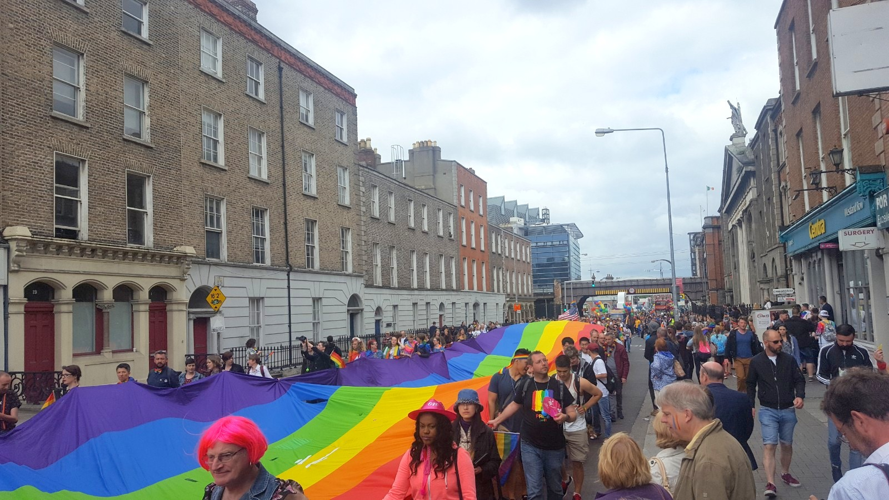

## A to Z of CarpentryCon

#### Compiled by: CarpentryCon 2020 Task Force
***Your pull-requests are welcome.***

Below you will find all the information that we thought might help you plan your trip to Madison, USA, for CarpentryCon 2020. We took this challenge to find all the keywords starting A-Z to address any queries you might have about the conference. We are pretty confident that the following list covers everything, but please reach out to us and let us know if something is missing. Please take a look at this so that you can plan your stay in Madison ahead of time and have the best time during the conference. We are very excited to meet you at CarpentryCon 2020!


##### *FIXME*

### A: Arrival, Access, Accommodation, Allies

#### Arrival and Access

The conference is being held in the [Discovery Building](https://discovery.wisc.edu/) at the [University of Wisconsin - Madison](https://wisc.edu/).

```
  Discovery Building
  University of Wisconsin-Madison
  330 N. Orchard St.
  WI 53715
  Madison
  United States
 ```

Link to [Google map](https://www.google.com/maps/d/viewer?mid=1FBVN_9iieOR2aAHLvyoULka6ySYUm-TS&usp=sharing) and [campus map](https://map.wisc.edu/). There is also a useful [Accessible Pedestrian Routes Map](https://map.wisc.edu/accessible-pedestrian-routes.pdf?1) that can be downloaded as a PDF.

The conference venues are accessible by car. For parking rates and locations, please see the [UW-Madison Transportation Office page](https://transportation.wisc.edu/parking-lots/). [Accessible parking](https://transportation.wisc.edu/accessible-transportation-options/#parking) is also available. Note, however, that parking on campus is limited and we cannot guarantee that parking will be available in your chosen location.

If possible, we recommend going to and from campus by alternative means:
- [Madison Metro Transit](https://www.cityofmadison.com/metro) offers many bus routes near the UW-Madison Campus and downtown. Check their website for routes, schedules and rates.
- [Bcycle](https://madison.bcycle.com/what-is) offer bike share service in Madison. Check their website for pickup and dropoff locations.
- [Union Cab](https://www.unioncab.com/) and [Green Cab](https://greencabmadison.com/) are local taxi services. Ride share services like Uber and Lyft also operate in Madison.

FIXME: [When you first arrive, you can exchange your registration ticket for a name tag, badges and lunch tickets. The registration desk will be located at the conference site from May 30 - June. We will have a designated Welcome Team of organizers and volunteers who you can recognize by their T-shirts and name tag. You will have access to the lecture hall and breakout rooms, look out for the signs at the venue. Do not hesitate to reach out to the Welcome Team during the conference for any query or concern. The venue is wheelchair accessible. The Welcome Team will be happy to provide you any additional support.]

#### Accommodation

We have listed all the [accommodation options](https://2020.carpentrycon.org/accommodation/) on the CarpentryCon website. We have reserved room blocks with several accommodation providers, shown on [this Google map](https://www.google.com/maps/d/viewer?mid=1FBVN_9iieOR2aAHLvyoULka6ySYUm-TS&usp=sharing).

#### Allies

An ally is someone who uses her/his/their societal privileges for supporting members of other identity groups. We would like to create an inclusive environment at CarpentryCon and invite you to extend your support to others at this conference and beyond.

### B: Badges, Break-out sessions, Bars

#### Badges

FIXME: We will offer you a range of badges (speakers, course maintainers, job seeker, new members etc.) to indicate your roles and interests in CarpentryCon and The Carpentries. These badges could be worn with your name tag to help you make the best of the social interaction at the conferences.

#### Break-out sessions

FIXME: There will be XXX breakout sessions during CarpentryCon (https://2020.carpentrycon.org/programme/) including the sessions on X, Y, and Z. There will be a limited number of seats available for each of these. Closer to the conference we will send out more information on how to register for those (look out for that).

#### Bars

FIXME

### C: Carpentries, CarpentryCon and Cheatsheet, Catering and Coffee, Child Care, Code of Conduct, Currency

#### The Carpentries
<br><br>

<br><br>

##### *Official logo of The Carpentries*

The Carpentries (https://carpentries.org/), brings Software and Data Carpentry together under an umbrella to teach foundational computational, coding, and data science skills to researchers worldwide. We are a diverse, global community of volunteer Instructors, helpers, Trainers, Maintainers, champions, member organizations, supporters, and staffs.

#### CarpentryCon 2020 and Conference Cheatsheet

CarpentryCon 2020 (https://2020.carpentrycon.org/) is the inaugural annual conference for all the members of the Carpentries. Under the theme “Growing Inclusive, Computational Communities and Leaders”, we have planned a number of events and opportunities for you including keynote talks, skill-up sessions, breakout discussions, social events, lightning talks, and workshops. This will provide a diverse and inclusive environment for learning, skill-building, and networking event for the participants interested in computational techniques to enhance the quality and efficiency of their work, and have a great time at the conference.

FIXME: See this [conference cheatsheet](https://github.com/carpentries/carpentrycon/blob/master/CarpentryCon_Cheatsheet.md) for all the relevant links to our resources and program.

##### Catering and Coffee

Of course! One of the most important conference supplies, coffee, will be offered at the conference during the breaks. Here is a list of all the [coffee/food places in UW-Madison](https://www.visitmadison.com/restaurants/), if you want to take a walk during and after the conference and find other non-conference coffee. Lunch will be provided at the conference for the registered participants. We will use the catering services of the FIXME located in the same building as the venue. We will take care of the different dietary requirements if you have mentioned it in your registration. Please let the organizers know if you'd like to amend your specified dietary requirements.

##### Child Care

FIXME: Parents/Families traveling with child/children must inform the organizers if they would be attending the conference with their child/children so that we can provide you with all the necessary information and support from our end. For mothers who need a designated space at the conference for nursing, please look for the nursing signs upon arrival of the conference.

##### Code of Conduct

As a member and conference participant, you are requested to familiarize yourself with The Carpentries' [Code of Conduct](https://docs.carpentries.org/topic_folders/policies/code-of-conduct.html).

*Code of Conduct in Short*: The Carpentries are dedicated to providing a welcoming and supportive environment for all people, regardless of background or identity. Enforcement of the Code of Conduct will be respectful and not include any harassing behaviors. Harassment in any form or behavior intended to exclude, intimidate, or cause discomfort is a violation of the Code of Conduct. If you believe someone is violating the Code of Conduct we ask that you report it to the CarpentryCon TaskForce members or the Code of Conduct committee members (FIXME) at the conference in person, by email or on Slack, who will take the appropriate action to address the situation. You can also reach out to the Carpentries Policy Committee by emailing policy@carpentries.org.

##### Currency

The currency used in the United States is United States Dollar (USD / $).
FIXME: See this article for everything you need to know about currency exchange in Dublin: https://transferwise.com/us/blog/currency-exchange-dublin

FIXME: TIP: if you are paying with a foreign bankcard/creditcard/debitcard and get asked whether you want to pay in USD or your own currency, choose USD - it will save you money in the end (see [this article]( https://www.forbes.com/sites/geoffreymorrison/2014/07/30/pay-in-local-or-home-currency/#5bb059723307)).

### D: Diversity

The Carpentries is a community of volunteer instructors, helpers, trainers, maintainers, champions, member organizations, supporters, and staff, of diverse background, nationality, ethnicity, gender and various identity groups. We are working hard to ensure that everyone feels welcome at CarpentryCon. Feel free to reach out to the organizers and staff if they can improve your experience as a member at The Carpentries and CarpentryCon. Attendees must be prepared to abide by our Code of Conduct (see *Allies, Carpentries, Code of Conduct, Inclusion, Emergency*).

### E: Emergency, Entertainment and Events, Etherpads, Executives, Exhibition

#### Emergency

In case of emergency, please contact the Welcome Team/organizers via phone **FIXME** (will be active only during the conference), email (carpentrycon@lists.carpentries.org) or [slack](FIXME).


FIXME: Here is a list of few other emergency contacts:
- Campus Services (for on-campus emergencies): 01 716 7999
- Ambulance/ Gardaí and Emergency Services: 999 or 112
- Nearest pharmacy: [Procare Pharmacy UCD](https://goo.gl/maps/hoxNWogRPWE2), Phone: 017163840
- Check the list of all other important contacts on [this page](https://github.com/carpentries/carpentrycon/blob/master/venue.md).

#### Entertainment and Events

FIXME: The evening before the conference, we will book a FIXME so that you get a head start on the social part of the conference. Please [fill this doodle](FIXME) with your name and email to be notified. The poster reception and conference dinner will allow you to get to know other attendees in informal settings and spend quality time with them at the conference. During the conference we have planned several opportunities for you (break-out, coffee breaks) and platforms ([etherpad](https://pad.carpentries.org/carpentrycon2020-social), [slack](https://tinyurl.com/carpentrycon-slack), [twitter](twitter.com/CarpentryCon)) to socialize with each other and make spontaneous plans to explore the city and surroundings during the evening. Take a lead and organize sessions and social activities with others.

#### Etherpads

We like to work collaboratively and use [Etherpad](http://pad.software-carpentry.org/pad-of-pads) for organizing our communication in different Carpentries channels. Here is a list of etherpads that are relevant for CarpentryCon.

- *Main CarpentryCon*: https://pad.carpentries.org/carpentrycon2020-main
- *Social Activities*: https://pad.carpentries.org/carpentrycon2020-social
- *CarpentryCon Community Call*: https://pad.carpentries.org/community-discussions (7 April, 14h00 UTC & 17h00 UTC)
- *CarpentryCon Volunteers*: https://pad.carpentries.org/carpentrycon2020-volunteers
- *CarpentryCon TaskForce Meetings*: https://pad.carpentries.org/2020carpentrycontaskforce
- *Pad-of-Pads for all other Carpentries etherpads*: http://pad.software-carpentry.org/pad-of-pads

#### Executives

FIXME: The Carpentries is governed by the newly formed Executive Council, to whom the Executive Director reports. The Council comprises nine members, four elected by the community, and five appointed from the former Steering Committees of Software and Data Carpentry. [Find out more about the council and their work](http://static.carpentries.org/governance/).

##### *Image source: http://img.pagecloud.com*

#### Exhibition

FIXME: We will offer an opportunity to the exhibitors (commercial and non-commercial) to acquire a booth at CarpentryCon. We can place max 25 exhibitors at the conference site, therefore contact the organizers for a possibility for you to have a booth there.

### F: Fitness, Friends and Family

#### Fitness

FIXME

#### Friends and Family

Your partner, family members or guests are invited to attend the keynote lectures and poster session if they are on campus during the conference. However, the break-out, skill-up, and workshops will be limited to the conference attendees for their participation. Here is a list of [on-campus cafe and restaurants](https://www.visitmadison.com/restaurants/) which will be accessible to them while they are in the UW-Madison area. FIXME: You can purchase a conference dinner ticket for partner/family member/friends through our [registration page](FIXME). Contact the organizers if we can help you in any way. See the related sections for *Childcare, Nursing, Medical, Events, Fitness* etc. for related information.

### G: FIXME


### H: Helpers and Helpdesk

We will have a helpdesk at the venue where you can get all the information that you may need during the conference. We will also have a designated Welcome Team, who will help you during the day to get orientated at the conference venue. For any request for special needs and help, get in touch with the organizers.

### I: Icebreaker, Inclusion

#### Icebreaker

Many people coming to CarpentryCon 2020 will be new to our community. We know that coming into any big event for the first time can be a little intimidating. You may not know anyone but it seems like everyone else knows lots of people. We want to make sure that everyone who comes to CarpentryCon 2020 feels a sense of belonging right from the start. As the first activity at CarpentryCon, we have planned an icebreaker event for everyone to connect with a small group of people.

#### Inclusion

We want to create an inclusive and welcoming environment at the conference. We are providing travel assistance to facilitate attendance from as wide a group as possible. We are collecting full details to identify needs for childcare and mobility, accessibility and dietary preferences during registration. Feel free to reach out to the organizers and staff if they can improve your participation at CarpentryCon. (see *Allies, Carpentries, Code of Conduct, Diversity, Emergency*)

### J: Job Board, Join the Carpentries

#### Job Board (Job Seekers & Job Providers)

We will have a job board at the conference where you can post/advertise both interest in jobs and relevant job offers.

#### Join the Carpentries

There are several ways to become a member of [The Carpentries community](https://carpentries.org/community/) and support its work. At CarpentryCon, there will be different booths for The Carpentries and opportunities to meet the volunteer members to learn more about it. See [here](https://carpentries.org/join/) for more detail.

### K: Keynote speakers, Knowledge sharing

#### Keynote speakers

We have fantastic keynote speakers lined up for you at CarpentryCon. We will reveal their names soon! 

#### Knowledge sharing

We, as organizers, have put a lot of efforts into making sure that you get several opportunities to learn new skills and ideas while expanding your network. In this 3-day high-intensity conference you will learn from: (1) the experts, through keynote talks, skill-up sessions, and workshops, (2) share your ideas with each other, in discussion/breakout sessions and get tips from the session leads and other attendees, (3) suggest, vote for and lead a session on the spot and share your own best practices and challenges. At the conference, you will be surrounded by the community leaders and trainers, and everyone is seeking to learn. We can assure you that you will get much more than 'just another conference experience', if you reach out to your neighbor during coffee breaks, at the watercoolers, while sharing charging stations, at lunches, in the breakout rooms, and at conference receptions.

### L: Library Carpentry, Lightning talks

#### Library Carpentry

Library Carpentry is made by librarians, for librarians, to help you automate repetitive, boring, error-prone tasks; create, maintain and analyse sustainable and reusable data; work effectively with IT and systems colleagues; better understand the use of software in research, and much more. Library Carpentry introduces you to the fundamentals of computing and provides you with a platform for further self-directed learning. See [here](http://librarycarpentry.github.io/our-sponsors/) for more detail. Library Carpentry and The Carpentries mutually decided to incorporate Library Carpentry as a Carpentries lesson program in 2018.

#### Lightning talks

We have lightning talk sessions (divided by topics) on the first and second day of the conference - please see the [conference program](https://2020.carpentrycon.org/programme/). You are welcome to submit abstracts using [this form](https://docs.google.com/forms/d/e/1FAIpQLSeEXTCSQFsPlHdK8ekSPZHxiyrZ3Y18GCjwfXIEt_9li9Jj9A/viewform).

### M: Medical, Meet-ups, Mentoring

#### Medical

We will have basic medication and first aid support at the venue. FIXME: The closest pharmacy is within 5 minutes walking distance, on the UW-Madison campus ([FIXME](FIXME), Phone: FIXME). If you have any specific medical needs, let the organizers know in advance so that they can make the necessary arrangements for you. See *Emergency* for other relevant contact lists.

#### Meet-ups

We will organize a pre-conference meet-up (more information will be added) and an official conference dinner. We will offer you opportunities to organize your own small meet-ups and invite the participants (see *Social Activities and Friends and Family*). If you have some ideas or suggestions, please let the organizers know so that they can help you in setting it up. Check out [this etherpad](https://pad.carpentries.org/carpentrycon2020-social) for existing ideas, and add your name under the relevant sections.

#### Mentoring

Mentorship is an important part of the Carpentry experience. As Instructors, we both teach and mentor our Learners. We also mentor each other as Instructors, learning something new from each other every time we teach and interact with one another. The Mentoring Subcommittee offers guidance to new and continuing Instructors through weekly discussion sessions, where Instructors from the global Carpentry community gather to share their experiences and learn from each other. This is a fantastic opportunity to interact with other Carpentry Instructors from around the world. (Read more about becoming a mentor or a mentee in [The Carpentries Handbook](https://docs.carpentries.org/topic_folders/instructor_development/mentoring_groups.html).

There are several things planned for you at the conference, which include break-out sessions, social activities, badges to show your involvement and a desk where you can learn more about the existing mentoring program and its activities.

### N: Name Tags, New Members, Nursing

#### Name Tags


##### *[Image source: mynamebadges.com](https://images.mynamebadges.com/img/lg/L/my-name-preferred-pronouns-label-lb-2525.pn)*

Name tags are a great way for participants to strike up conversations with other participants or volunteers. You can collect your name tag at the registration desk (don't forget to bring your registration ticket). We will be offering you a list of badges (e.g. speaker, trainer, task-force, volunteers, new members, etc.) to add to your name tag to let others know your interests, roles and expertise, which will help you network more efficiently. Our name tags will have a section to add your pronoun preference. As a participant, be respectful to each other by using the correct name and pronoun. Ask! if you don't know how to pronounce someone's name, maybe they will share a nice story about what their name means.

#### New Members

Are you new to The Carpentries? Do you want to learn more about the organization and how you can support it? CarpentryCon is the place for you. Actually a **_better_** start for you than the rest of us had, as you will have an opportunity for face-to-face networking and interaction. We understand that it could be frightening if you don't know anyone, but the community has a history of being very friendly and inclusive, so don't be afraid to say 'Hi' and introduce yourself. You will be surprised how many lasting collaborations you will make at the conference. Join the ice-breaking session to get a head start to networking, and when in doubt, contact the Welcome Team.

#### Nursing

For mothers who need a designated space for nursing, please look for the nursing signs upon arrival of the conference. Please let the organizers know if you will be traveling with an infant and would like to place any special requests. Please see *Childcare, Special Requirements, Friends and Family* for related information.

### O: FIXME

FIXME

### P: Photography, Posters, Pre-conference, Post-conference, Pronouns

#### Photography

You are allowed to take photographs at the conference. Make sure that you do not disturb any session or others in the process. We will offer a differently colored lanyard to those who **don't want to be photographed**. Be respectful of their decision and don't take/post their pictures on social media. A few volunteers will be taking pictures to be included to the official collection, you are welcome to join them. If you want to post pictures on social media, use the hastag #CarpentryCon2020Madison to tag the conference, so that other attendees and those who couldn't join the conference can find your posts.

#### Posters

We will have a poster session and a designated area for the display of posters. You should use the A0 poster size (vertical). Any other specifications will be added if required. The deadline for the abstract submission is April 30th.

#### Pre-conference

We will send out an email to all the registered participants with all the information we think you must have before arriving to the conference including the [CarpentryCon cheatsheet](FIXME). The email will have a link to the pre-conference survey to allow you to choose your sessions of preference and add any special need that you may have. It's crucial that you respond to the survey to secure a place in the sessions of your choice.

##### Pre-conference checklist

A personal checklist may have very basic reminders like: check your flight_schedule-alarm-passport-visa-keys-wallet-cash-hotel_address-charger-headphones-book-clothes-phone-laptop, take out the garbage, water your plant, lock your door, panic (*did I close the windows!*) - you get it. Malvika previously asked twitter for advice. [Here is what she got](https://twitter.com/MalvikaSharan/status/990973533823078400):

<blockquote class="twitter-tweet" data-lang="en"><p lang="en" dir="ltr">What do you have in your pre-conference list? Help me fill this list for the <a href="https://twitter.com/CarpentryCon?ref_src=twsrc%5Etfw">@CarpentryCon</a> participants who are coming to <a href="https://twitter.com/ucddublin?ref_src=twsrc%5Etfw">@ucddublin</a> <a href="https://twitter.com/hashtag/Dublin?src=hash&amp;ref_src=twsrc%5Etfw">#Dublin</a> to attend the <a href="https://twitter.com/hashtag/carpentrycon2018?src=hash&amp;ref_src=twsrc%5Etfw">#carpentrycon2018</a>. Pull requests are welcome on this <a href="https://twitter.com/github?ref_src=twsrc%5Etfw">@github</a> link: <a href="https://t.co/fL1uVvxwT1">https://t.co/fL1uVvxwT1</a></p>&mdash; Malvika Sharan (@MalvikaSharan) <a href="https://twitter.com/MalvikaSharan/status/989883041035276288?ref_src=twsrc%5Etfw">April 27, 2018</a></blockquote>

<blockquote class="twitter-tweet" data-lang="en"><p lang="en" dir="ltr">Do you mean these kinds of things? Business cards. Stuff to read while traveling. Power adaptors (many non-UK will need one). Some local currency. A4/US letter printouts of your poster to hand out.</p>&mdash; Lex Nederbragt (@lexnederbragt) <a href="https://twitter.com/lexnederbragt/status/991010647025618944?ref_src=twsrc%5Etfw">April 30, 2018</a></blockquote>

<blockquote class="twitter-tweet" data-lang="en"><p lang="en" dir="ltr">Ok, some more then. If you are going to present from your own laptop, video adapter(s) (most places do HDMI now, but VGA is still around). Ear plugs for when the accommodation is noisy. Some nuts or other healthy snacks for when you’re hungry and far away from food.</p>&mdash; Lex Nederbragt (@lexnederbragt) <a href="https://twitter.com/lexnederbragt/status/991231811622719488?ref_src=twsrc%5Etfw">May 1, 2018</a></blockquote>

Also, someone has already written a blog on [What to Pack & Prepare Before Any Big Conference](https://blog.hubspot.com/marketing/pre-conference-packing-checklist).

#### Post-conference

The post-conference period will be equally crucial to evaluate the success of the conference. Please fill the [post-conference survey](FIXME) after the conference to learn about your experiences from this conference and suggestions for the next one. We will also organize a community call to discuss the survey results and the plans for the next conference: carpentryCon 2019.

#### Pronouns

It has become a general practice to share pronouns (He/She/They/Ze etc.) on conference name tags. For those unfamiliar with the practice of sharing pronouns at the conference, it goes something like this: “Name: Malvika Sharan. Pronouns: she/her”. This practice is important for making sure that we use correct pronouns, specifically for our trans, queer, and gender non-conforming community members you will meet at CarpentryCon.

### Q: Questions, Quiet Rooms

#### Questions

Get in touch with the organizers (carpentrycon@lists.carpentries.org) if you have any specific questions about the conference. At the conference, you can approach the Welcome Team for any specific queries. Join our [Slack channel](https://tinyurl.com/carpentrycon-slack1) for any recent discussion and updates.

#### Quiet Rooms

If you need a quiet place while attending CarpentryCon, there will be space available. Please see the program or ask a volunteer where the room will be located. We ask that while you are in the room that you are mindful of others who may be sharing the space as well.

The following prayer rooms are available on campus:
- FIXME
- FIXME

### R: Registration, Restaurant suggestions

#### Registration

The [online registration](https://www.eventbrite.com/e/carpentrycon-2020-tickets-88906089507) is open. We will have an opportunity for on-site registration, but please let the organizers know in advance. More information about the workshop registrations will be added here.

The registration desk will be available on site from June 29 to July 1. Please bring your registration confirmation, which can be swapped for your name tag and badges.

#### Restaurant suggestions

We will be using the catering service from FIXME, which is located in the same builiding as the conference venue. More restaurant suggestions, including [FIXME](FIXME), are available on the etherpad dedicated to the discussion on [social activities at CarpentryCon](https://pad.carpentries.org/carpentrycon2020-social). If you have any recommendations, please add them there. 

### S: Sightseeing, Skill-up, Slack, Software Carpentry, Special requirements, Sponsors, Sticky Notes, Surveys

#### Sightseeing

FIXME

#### Skill-up

There will be 6 skill-up sessions during CarpentryCon (https://2020.carpentrycon.org/programme/). The abstracts of all the sessions will be announced soon. There will be a limited number of seats available for each of these. Closer to the conference we will send out more information on how to register for those (look out for that).

#### Slack

We are on Slack: FIXME. Join us there to connect and communicate with the organizers and participants of CarpentryCon. We will be actively using the various channels for continuing discussions, and documenting them to summarise different aspects of the conference. Also, you can install Slack apps to have access to these channels through your phone.

#### Software Carpentry

The Software Carpentry Foundation and its sibling project, Data Carpentry, have merged to become The Carpentries. Since 1998, Software Carpentry has been teaching researchers the computing skills they need to get more done in less time and with less pain. Our volunteer instructors have run hundreds of events for more than 34,000 researchers since 2012. All of our lesson materials are freely reusable under the Creative Commons - Attribution license.

Like *Data Carpentry*, we will have a desk at the conference where you can learn more about this project.

#### Special requirements

We want to assist you in all possible ways to make your participation at CarpentryCon enjoyable and stress-free. Please contact the organizers with any requests for special needs so that we can make arrangements before your arrival. Do not hesitate to contact the Welcome Team during the meeting for any help. (see *Arrival and Access, Childcare, Inclusion*)

#### Sponsors

CarpentryCon 2020 will not be possible without the generous support of businesses and foundations who support our mission of teaching foundational computational and data science skills to researchers, to safeguard the future of sound, open, reproducible science. Here is the [list of our sponsors](FIXME). Do you/your organization want to support our event? See [details on our official website](https://2020.carpentrycon.org/sponsorship/) to learn all about it.

#### Sticky Notes

We love sticky notes! No Carpentries workshop is possible without the sticky notes. See [Greg's collection of tips and techniques for teaching with sticky notes](https://github.com/gvwilson/sticky-note-teaching) to learn the various reasons it makes learning and teaching easier. Therefore, we will be using (even over-using!) these during the skill-up sessions, workshops and wherever possible.

#### Surveys

Please fill out the pre-conference survey before your arrival to help us organize everything you may need at the conference (e.g. any special needs, suggestions, etc.). The post-conference survey will be used to evaluate your overall experience at the conference, which will help us to improve our efforts while organizing future conferences and meetings.

**Links to the surveys:**
- Pre-conference Survey: FIXME
- Post-conference Survey: FIXME

### T: T-shirts, TaskForce, Technical Support, Travel/Transportation, Twitter

#### T-shirts
Would you like to have a keepsake of this momentus occasion for the Carpentries? Order yourself a t-shirt to show your pride. More information will be added [here](FIXME) to ensure you have your shirt for CarpentryCon!

#### TaskForce

The CarpentryCon TaskForce was created in 2019 by the volunteers from the community with an intention to organize the inaugural CarpentryCon conference. The team worked out the initial plan for the conference, and kept recruiting the volunteers and passed over the role of organizing the meeting. The current Organizing TaskForce comprises both volunteers and The Carpentries staff members. Several of the TaskForce members will be at the conference. Stop by and say 'Hi' to us and let us know if you have any suggestions or interest in joining us for the next conference.

- Current members of the Organizing TaskForce: https://2020.carpentrycon.org/task-force/
- Common email: carpentrycon@lists.carpentries.org
- CarpentryCon 2020 Volunteers from UW-Madison: They are very crucial for this event while we are not on site. A special shout out to each of them.

#### Technical Support

We will have technical support at the conference from the FIXME services. A few volunteers will be willing to help you with any technical difficulties that you might face at the conference. You can inquire about this at the helpdesk or by directly approaching the members of the Welcome Team.

Here are a few tips to help you use your electronic devices in Madison:


##### *Image source: [Adapters to keep your electronics charged in Ireland - irishfireside.com](http://irishfireside.com/2016/04/07/qa-kind-electrical-adapter-need-keep-electronics-charged-ireland/)*

1) Bring a Type-G (compatible) power adapter. Check the requirements [here](FIXME).
2) If you are using your laptop for a presentation, bring your adapter to connect it with the projector (HDMI or VGA).
3) You can take pictures at the conference. Check the sign on the participants badges to make sure if they have chosen to be photographed.
4) If you have any errors while running your program, send a tweet or ask for help on the Slack channels.

#### Travel and Transportation

##### Getting Here By Air
The closest airport to UW-Madison is Dane County Regional Airport (MSN). Flights to here can be more expensive, as it is a small airport, but getting to campus from MSN is easy on a Metro Bus, by taxi or by rideshare services. Alternative airports include Mitchell International Airport (MKE) in Milwaukee, WI, O’Hare International Airport (ORD) and Chicago Midway International Airport in Chicago, IL. There is a regular, reliable regional bus service from the Chicago airports to Madison (see below).

##### Getting Here By Bus
Regional buses run from Chicago Midway Airport, Chicago O’Hare Airport and Downtown Chicago (see [Van Galder Bus](https://web.coachusa.com/vangalder/) or [Megabus](https://us.megabus.com/) for more details). Regional buses run from Milwaukee to Madison (see [Badger Bus](https://badgerbus.com/tickets/) or [Megabus](https://us.megabus.com/) for more details).

##### Getting to UW-Madison
The conference venues are accessible by car. For parking rates and locations, please see the [UW-Madison Transportation Office page](https://transportation.wisc.edu/parking-lots/). [Accessible parking](https://transportation.wisc.edu/accessible-transportation-options/#parking) is also available. Note, however, that parking on campus is limited and we cannot guarantee that parking will be available in your chosen location.

If possible, we recommend going to and from campus by alternative means:
- [Madison Metro Transit](https://www.cityofmadison.com/metro) offers many bus routes near the UW-Madison Campus and downtown. Check their website for routes, schedules and rates.
- [Bcycle](https://madison.bcycle.com/what-is) offer bike share service in Madison. Check their website for pickup and dropoff locations.
- [Union Cab](https://www.unioncab.com/) and [Green Cab](https://greencabmadison.com/) are local taxi services. Ride share services like Uber and Lyft also operate in Madison.

#### Twitter

We have a Twitter account dedicated to CarpentryCon feed, [follow us](https://twitter.com/CarpentryCon)!
We would love to see your pictures and tweets about CarpentryCon. Use the **#CarpentryCon2020Madison** hashtag to tag CarpentryCon.

### U: UW-Madison

FIXME

### V: Veg()an+, Visa, Volunteers

#### Veg()an+

We want to be able to provide you catering keeping your dietary restrictions into account (e.g. Veg(etari)ans, Gluten-free, Nut-free etc). Make sure that you provide your preference while registering. If you forgot about it, contact the organizers with your request.

#### Visa

If you are traveling from outside of the United States, please confirm that you have the [necessary visa needed to enter the United States](https://travel.state.gov/content/travel/en/us-visas.html). You can check if and what type of visa you require by using the US Government's [Visa Wizard](https://travel.state.gov/content/travel/en/us-visas/visa-information-resources/wizard.html).

In case you need to apply for a visa, you should do so at minimum 2-3 weeks before the conference. You can receive a visa support letter from the conference organizers: please contact carpentrycon@lists.carpentries.org with your request.

#### Volunteers

A group of volunteers will always be present at the venue to help you coordinate with the organizers, session chairs, venue manager, and find your way to the different rooms at the venue.

If you are at UW-Madison already or coming to the conference, you can offer your help to us by volunteering at CarpentryCon 2020.
How to become a CarpentryCon Volunteer? Contact us: carpentrycon@lists.carpentries.org.

### W: Watercoolers, Weather, Welcome Team, Wireless, Wish board, Workshops 

#### Watercoolers

FIXME: Watercoolers will be available in several spots of the conference venue. Try to minimize the waste by avoiding packaged water bottles, and re-using your cups.

#### Weather

FIXME: In Madison, the summers are warm and wet; the winters are freezing, dry, and windy; and it is partly cloudy year round. Over the course of the year, the temperature typically varies from 13°F to 82°F and is rarely below -7°F or above 90°F. From mid-June to early September, i.e. during CarpentryCon 2020, we will have warm weather. Pack accordingly!

#### Welcome Team

The group of volunteers and organizers will be the part of this Welcome Team who will guide you and will be there to offer you any sort of assistance from the beginning to the end of the conference. Make yourself familiar with them (name tag, T-shirt etc.).

#### Wireless

FIXME

#### Wish board

At the conference site, we will put a wish-board for you, where you can add your 'wish' for CarpentryCon, The Carpentries, and its community. We will let you decide what this means to you! :)

#### Workshops

On the last day of the conference, July 1, we will run several parallel workshop sessions. There will be a limited number of seats available for each of these workshops and you will receive an email from us stating how you can secure a place in the workshop of your choice.

### X: _X out inequality_



##### *Rainbow Road from Mario Cart Recreated at the Dublin Pride Parade, image by Norman Davey*

*We can't emphasize this enough!*

The globally diverse community of The Carpentries provides equal opportunities to everyone irrespective of their background (both technical and non-technical). We will maintain the same ethics at CarpentryCon and request all our participants to familiarize themselves with our [Code of Conduct](https://docs.carpentries.org/topic_folders/policies/code-of-conduct.html).

***Discrimination in any form, including behavior or remarks against any nationality, ethnicity, sexuality, religious and cultural belief, will not be tolerated!*** (also see *Allies, Code of Conduct, Diversity, Inclusion*)

### Y: You!

This event is for **you**. The success of this conference will be measured by what you gain at the conference and afterward in terms of skills, knowledge, and networking.

Be mindful that the organizers are also volunteers who are organizing this for the community by working beyond their work. Therefore, we invite you to step in if you see that something at the conference is not working and you have the idea and capacity to *fix* it for others.

### Z: Zoom for TaskForce, Volunteers, and Community Calls

We use [Zoom](https://zoom.us/) (not a sponsor!), for our calls to connect with community members. See *Etherpads* for all the relevant etherpads. We will plan a CarpentryCon-themed community call in May/June to help people get excited about what is coming, as well as answer any questions the community might have. See [this etherpad](FIXME) for connection information and Zoom link.

**We are looking forward to welcoming you to CapentryCon 2020!**


Yours,

CarpentryCon Taskforce - from different Time Zones.
